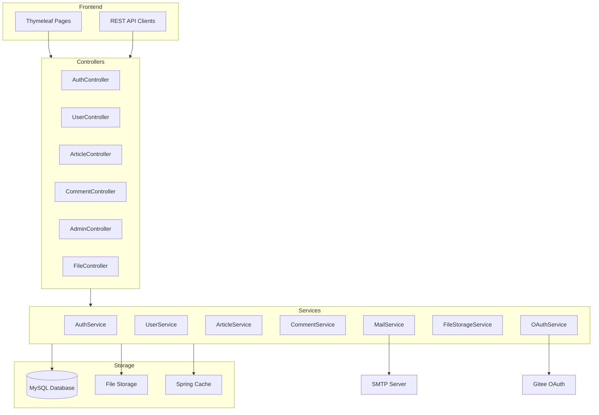
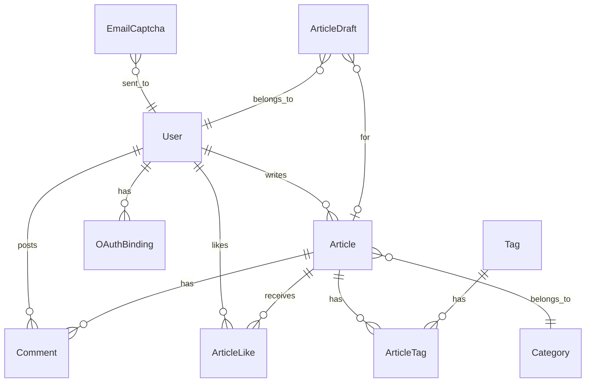

# Design Document

## Overview

本设计文档描述个人博客系统增强版的技术架构和实现方案。系统基于现有 Spring Boot 2.7 + MySQL 架构进行扩展，采用模块化设计支持未来功能扩展。

## Architecture



## Components and Interfaces

### 1. 认证模块 (Authentication Module)

#### AuthService 接口
```java
public interface AuthService {
    // 用户名密码登录
    AuthResponse loginByUsername(String username, String password);
    
    // 邮箱密码登录
    AuthResponse loginByEmail(String email, String password);
    
    // 邮箱验证码登录
    AuthResponse loginByEmailCaptcha(String email, String captcha);
    
    // Gitee OAuth 登录
    AuthResponse loginByGitee(String code);
    
    // 发送邮箱验证码
    void sendEmailCaptcha(String email, CaptchaType type);
    
    // 验证验证码
    boolean verifyCaptcha(String email, String captcha, CaptchaType type);
}
```

#### CaptchaService 接口
```java
public interface CaptchaService {
    // 生成并发送验证码
    void generateAndSend(String email, CaptchaType type);
    
    // 验证验证码
    boolean verify(String email, String captcha, CaptchaType type);
    
    // 验证码类型枚举
    enum CaptchaType {
        REGISTER,      // 注册验证
        LOGIN,         // 登录验证
        EMAIL_CHANGE,  // 邮箱变更
        PASSWORD_RESET // 密码重置
    }
}
```

### 2. 用户模块 (User Module)

#### UserService 接口扩展
```java
public interface UserService {
    // 用户注册
    User register(RegisterRequest request);
    
    // 更新用户资料
    User updateProfile(Long userId, ProfileUpdateRequest request);
    
    // 更新头像
    User updateAvatar(Long userId, MultipartFile file);
    
    // 变更邮箱
    void changeEmail(Long userId, String newEmail, String captcha);
    
    // 修改密码
    void changePassword(Long userId, String oldPassword, String newPassword);
    
    // 绑定第三方账号
    void bindOAuthAccount(Long userId, OAuthProvider provider, String oauthId);
}
```

### 3. 文章模块 (Article Module)

#### ArticleService 接口扩展
```java
public interface ArticleService {
    // 创建文章（支持定时发布）
    Article createArticle(ArticleRequest request, Long userId);
    
    // 自动保存草稿
    Article saveDraft(Long articleId, String content);
    
    // 定时发布检查（由调度器调用）
    void publishScheduledArticles();
    
    // 点赞/取消点赞
    boolean toggleLike(Long articleId, Long userId);
    
    // 检查用户是否已点赞
    boolean hasUserLiked(Long articleId, Long userId);
}
```

### 4. 评论模块 (Comment Module)

#### CommentService 接口扩展
```java
public interface CommentService {
    // 创建评论（登录用户）
    Comment createComment(CommentRequest request, Long userId);
    
    // 创建匿名评论
    Comment createAnonymousComment(CommentRequest request, String ip, String nickname);
    
    // 审核评论
    void moderateComment(Long commentId, CommentStatus status);
    
    // 获取嵌套评论树
    List<CommentTree> getCommentTree(Long articleId);
    
    // 发送评论通知
    void sendCommentNotification(Comment comment);
}
```

### 5. 文件存储模块 (File Storage Module)

#### FileStorageService 接口
```java
public interface FileStorageService {
    // 上传文件
    FileUploadResult upload(MultipartFile file, FileType type);
    
    // 删除文件
    void delete(String fileUrl);
    
    // 获取文件访问URL
    String getAccessUrl(String filePath);
}

// 存储提供者接口（策略模式）
public interface StorageProvider {
    String upload(InputStream inputStream, String fileName, String contentType);
    void delete(String filePath);
    String getAccessUrl(String filePath);
}
```

### 6. 后台管理模块 (Admin Module)

#### AdminService 接口
```java
public interface AdminService {
    // 获取仪表盘统计
    DashboardStats getDashboardStats();
    
    // 网站配置管理
    SiteConfig getSiteConfig();
    void updateSiteConfig(SiteConfig config);
}
```

## Data Models

### 新增/修改实体

#### EmailCaptcha 实体
```java
@Entity
@Table(name = "email_captcha")
public class EmailCaptcha {
    @Id
    @GeneratedValue(strategy = GenerationType.IDENTITY)
    private Long id;
    
    @Column(nullable = false)
    private String email;
    
    @Column(nullable = false, length = 6)
    private String captcha;
    
    @Enumerated(EnumType.STRING)
    private CaptchaType type;
    
    @Column(name = "expire_time", nullable = false)
    private LocalDateTime expireTime;
    
    @Column(name = "create_time")
    private LocalDateTime createTime;
    
    private Boolean used = false;
}
```

#### OAuthBinding 实体
```java
@Entity
@Table(name = "oauth_binding")
public class OAuthBinding {
    @Id
    @GeneratedValue(strategy = GenerationType.IDENTITY)
    private Long id;
    
    @Column(name = "user_id", nullable = false)
    private Long userId;
    
    @Enumerated(EnumType.STRING)
    private OAuthProvider provider; // GITEE, GITHUB, etc.
    
    @Column(name = "oauth_id", nullable = false)
    private String oauthId;
    
    @Column(name = "oauth_name")
    private String oauthName;
    
    @Column(name = "oauth_avatar")
    private String oauthAvatar;
    
    @Column(name = "create_time")
    private LocalDateTime createTime;
}
```

#### ArticleLike 实体
```java
@Entity
@Table(name = "article_like")
public class ArticleLike {
    @Id
    @GeneratedValue(strategy = GenerationType.IDENTITY)
    private Long id;
    
    @Column(name = "article_id", nullable = false)
    private Long articleId;
    
    @Column(name = "user_id", nullable = false)
    private Long userId;
    
    @Column(name = "create_time")
    private LocalDateTime createTime;
}
```

#### ArticleDraft 实体
```java
@Entity
@Table(name = "article_draft")
public class ArticleDraft {
    @Id
    @GeneratedValue(strategy = GenerationType.IDENTITY)
    private Long id;
    
    @Column(name = "article_id")
    private Long articleId; // null for new articles
    
    @Column(name = "user_id", nullable = false)
    private Long userId;
    
    private String title;
    
    @Column(columnDefinition = "LONGTEXT")
    private String content;
    
    @Column(name = "update_time")
    private LocalDateTime updateTime;
}
```

#### SiteConfig 实体
```java
@Entity
@Table(name = "site_config")
public class SiteConfig {
    @Id
    @GeneratedValue(strategy = GenerationType.IDENTITY)
    private Long id;
    
    @Column(name = "config_key", unique = true, nullable = false)
    private String configKey;
    
    @Column(name = "config_value", columnDefinition = "TEXT")
    private String configValue;
    
    private String description;
    
    @Column(name = "update_time")
    private LocalDateTime updateTime;
}
```

#### FriendLink 实体
```java
@Entity
@Table(name = "friend_link")
public class FriendLink {
    @Id
    @GeneratedValue(strategy = GenerationType.IDENTITY)
    private Long id;
    
    @Column(nullable = false)
    private String name;
    
    @Column(nullable = false)
    private String url;
    
    private String logo;
    
    private String description;
    
    @Column(name = "sort_order")
    private Integer sortOrder = 0;
    
    private Integer status = 1;
    
    @Column(name = "create_time")
    private LocalDateTime createTime;
}
```

#### User 实体扩展字段
```java
// 在现有 User 实体中添加
@Column(name = "email_verified")
private Boolean emailVerified = false;

@Column(name = "last_login_time")
private LocalDateTime lastLoginTime;

@Column(name = "last_login_ip")
private String lastLoginIp;
```

#### Article 实体扩展字段
```java
// 在现有 Article 实体中添加
@Column(name = "scheduled_time")
private LocalDateTime scheduledTime; // 定时发布时间

@Column(name = "allow_comment")
private Boolean allowComment = true; // 是否允许评论
```

#### Comment 实体扩展字段
```java
// 在现有 Comment 实体中添加
@Column(name = "nickname")
private String nickname; // 匿名评论昵称

@Column(name = "email")
private String email; // 匿名评论邮箱（用于通知）

@Column(name = "is_anonymous")
private Boolean isAnonymous = false;
```

### ER 图




## Correctness Properties

*A property is a characteristic or behavior that should hold true across all valid executions of a system-essentially, a formal statement about what the system should do. Properties serve as the bridge between human-readable specifications and machine-verifiable correctness guarantees.*

Based on the acceptance criteria analysis, the following correctness properties have been identified:

### Property 1: Credential Authentication Consistency
*For any* valid user credentials (username/password or email/password), authenticating with those credentials SHALL return a valid JWT token, and authenticating with invalid credentials SHALL return an error without revealing which field is incorrect.
**Validates: Requirements 1.1, 1.2, 1.8**

### Property 2: Captcha Format and Expiration
*For any* generated captcha, the captcha SHALL be exactly 6 digits, and *for any* captcha older than 5 minutes, verification SHALL fail.
**Validates: Requirements 1.3, 1.5**

### Property 3: Captcha Authentication Round-Trip
*For any* valid email and freshly generated captcha, submitting the captcha within 5 minutes SHALL successfully authenticate the user.
**Validates: Requirements 1.4, 2.2**

### Property 4: Password Encryption Invariant
*For any* user registration or password change, the stored password SHALL never equal the plaintext password and SHALL match BCrypt format pattern.
**Validates: Requirements 2.3**

### Property 5: Registration Uniqueness Constraint
*For any* registration attempt with an email or username that already exists in the system, the registration SHALL be rejected.
**Validates: Requirements 2.4, 2.5**

### Property 6: Default Role Assignment
*For any* newly registered user, the user role SHALL be set to "USER" by default.
**Validates: Requirements 2.6**

### Property 7: Profile Update Persistence
*For any* profile update (nickname, introduction), reading the profile after update SHALL return the updated values.
**Validates: Requirements 3.1, 3.2**

### Property 8: Introduction Length Constraint
*For any* self-introduction text longer than 500 characters, the update SHALL be rejected or truncated.
**Validates: Requirements 3.2**

### Property 9: Avatar File Validation
*For any* uploaded avatar file, the system SHALL accept only JPG/PNG/GIF types with size <= 2MB, and reject all others.
**Validates: Requirements 3.3**

### Property 10: Password Change Security
*For any* password change request, the change SHALL succeed only if the old password verification passes.
**Validates: Requirements 3.7, 3.8**

### Property 11: Like Toggle Round-Trip
*For any* article and user, liking then unliking (or vice versa) SHALL return the like count to its original value.
**Validates: Requirements 4.6, 4.7**

### Property 12: View Count Increment
*For any* article view, the view count SHALL increase by exactly 1.
**Validates: Requirements 4.5**

### Property 13: Scheduled Publish Timing
*For any* article with scheduled publish time, the article status SHALL change to published when current time >= scheduled time.
**Validates: Requirements 4.3**

### Property 14: Comment Nesting Integrity
*For any* reply comment, the parent_id SHALL reference a valid existing comment, and the comment tree structure SHALL be consistent.
**Validates: Requirements 5.4**

### Property 15: Comment Moderation Default Status
*For any* new comment when moderation is enabled, the initial status SHALL be "pending".
**Validates: Requirements 5.3**

### Property 16: Taxonomy Article Count Accuracy
*For any* category or tag, the displayed article count SHALL equal the actual number of published articles in that category/tag.
**Validates: Requirements 6.5, 6.6**

### Property 17: Category Deletion Cascade
*For any* deleted category, all articles previously in that category SHALL have their category_id set to null (uncategorized).
**Validates: Requirements 6.3**

### Property 18: Tag Auto-Creation
*For any* new tag name added to an article, if the tag doesn't exist, a new tag record SHALL be created.
**Validates: Requirements 6.4**

### Property 19: Search Result Relevance
*For any* search query, all returned articles SHALL contain the search keyword in either title or content.
**Validates: Requirements 7.1**

### Property 20: Archive Grouping Correctness
*For any* article in the archive, the article SHALL appear in the group corresponding to its publish year and month.
**Validates: Requirements 7.3, 7.4**

### Property 21: File Validation Rules
*For any* file upload, files with disallowed types or exceeding size limits SHALL be rejected with appropriate error messages.
**Validates: Requirements 8.3, 8.4, 8.6**

### Property 22: File Upload URL Generation
*For any* successful file upload, the returned URL SHALL be accessible and point to the uploaded file.
**Validates: Requirements 8.5**

### Property 23: Dashboard Statistics Accuracy
*For any* dashboard view, the displayed counts (articles, comments, users, views) SHALL match the actual database counts.
**Validates: Requirements 9.1**

### Property 24: Site Config Persistence
*For any* site configuration update, reading the config after update SHALL return the updated values.
**Validates: Requirements 9.5**

### Property 25: Taxonomy Filtering Correctness
*For any* category or tag page, all displayed articles SHALL belong to that specific category or have that specific tag.
**Validates: Requirements 10.2, 10.3**

### Property 26: Article List Ordering
*For any* article list on homepage, articles SHALL be ordered by create_time descending (latest first).
**Validates: Requirements 10.1**

## Error Handling

### Authentication Errors
| Error Code | Description | HTTP Status |
|------------|-------------|-------------|
| AUTH_001 | Invalid credentials | 401 |
| AUTH_002 | Captcha expired | 400 |
| AUTH_003 | Captcha invalid | 400 |
| AUTH_004 | Account disabled | 403 |
| AUTH_005 | OAuth authorization failed | 401 |

### Validation Errors
| Error Code | Description | HTTP Status |
|------------|-------------|-------------|
| VAL_001 | Email already registered | 400 |
| VAL_002 | Username already taken | 400 |
| VAL_003 | Invalid file type | 400 |
| VAL_004 | File size exceeded | 400 |
| VAL_005 | Content too long | 400 |

### Resource Errors
| Error Code | Description | HTTP Status |
|------------|-------------|-------------|
| RES_001 | Article not found | 404 |
| RES_002 | Comment not found | 404 |
| RES_003 | User not found | 404 |
| RES_004 | Category not found | 404 |

## Testing Strategy

### Property-Based Testing Framework
本项目使用 **jqwik** 作为 Java 的属性测试框架，它与 JUnit 5 集成良好。

Maven 依赖：
```xml
<dependency>
    <groupId>net.jqwik</groupId>
    <artifactId>jqwik</artifactId>
    <version>1.8.2</version>
    <scope>test</scope>
</dependency>
```

### Testing Approach

**Unit Tests:**
- Service 层方法的基本功能测试
- Repository 层的 CRUD 操作测试
- 工具类方法测试

**Property-Based Tests:**
- 每个正确性属性对应一个属性测试
- 使用 jqwik 的 `@Property` 注解
- 配置最少 100 次迭代
- 测试注释必须引用设计文档中的属性编号

**Integration Tests:**
- API 端点的集成测试
- 认证流程的端到端测试
- 文件上传流程测试

### Test Annotation Format
```java
/**
 * Feature: blog-enhanced, Property 1: Credential Authentication Consistency
 * Validates: Requirements 1.1, 1.2, 1.8
 */
@Property(tries = 100)
void credentialAuthenticationConsistency(@ForAll @ValidCredential Credential credential) {
    // test implementation
}
```
