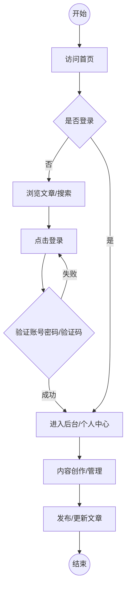
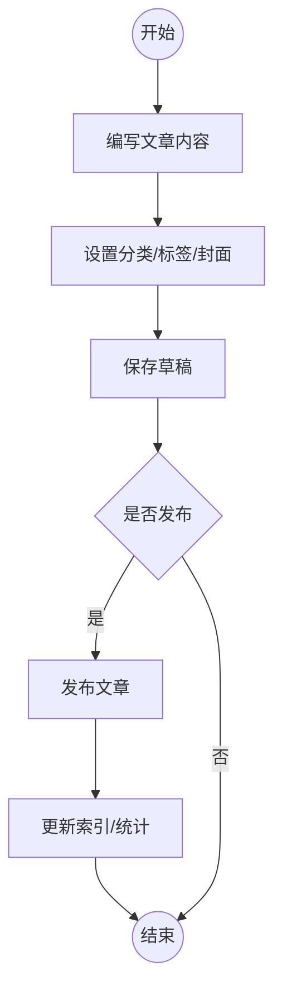

# 个人博客系统设计书

## 1. 综述

### 1.1 编写目的
本设计书旨在明确个人博客系统的架构设计、数据库设计及界面功能模块，为后续开发工作提供详细的技术指导。

### 1.2 系统背景与项目介绍
本项目是一个基于 **Spring Boot** 构建的现代化全栈个人博客系统。它不仅仅是一个简单的写作平台，更是一个功能完备、架构灵活、易于扩展的内容管理系统（CMS）。项目采用前后端混合渲染模式（Thymeleaf + AJAX），在保证 SEO 友好的同时提供了流畅的用户体验。系统设计遵循模块化原则，支持多种登录方式、存储策略切换以及丰富的内容管理功能。

### 1.3 项目设计原则
*   **高可用性**：系统应保证 24 小时稳定运行。
*   **安全性**：采用严格的认证授权机制，保障用户数据安全。
*   **可扩展性**：采用分层架构，便于后续功能模块的扩展。

<div style="page-break-after: always;"></div>

## 2. 系统流程图

### 2.1 用户业务流程
本系统区分普通访客与注册用户。普通访客可浏览文章、搜索内容；注册用户可进行评论互动；管理员拥有完整的内容管理权限。



### 2.2 文章发布流程
管理员/作者在后台进行文章创作，支持 Markdown 编辑、封面上传、标签选择等操作，发布后在前台展示。



<div style="page-break-after: always;"></div>

## 3. 系统架构与技术选型

### 3.1 技术选型说明

考虑到开发效率与系统性能，本项目选用的具体技术如下表所示：

| 技术类别 | 方案 |
| :--- | :--- |
| **开发语言** | Java 1.8 / Java 21 |
| **后端框架** | Spring Boot 2.7.0 + Spring Data JPA + Spring Security |
| **数据库** | MySQL 8.0+ |
| **前端框架** | Thymeleaf + Bootstrap 5 + jQuery (前后端混合渲染) |
| **富文本编辑器** | wangEditor / Markdown Editor |
| **服务器** | Tomcat 9.0+ (Embedded) |
| **开发工具** | IntelliJ IDEA, Navicat, Maven |

### 3.2 系统分层架构

系统采用标准的 MVC 分层架构，各层职责清晰，通过接口进行交互。

```mermaid
graph TD
    subgraph ClientLayer [客户端层]
        Browser[浏览器 (PC/Mobile)]
    end

    subgraph BoundaryLayer [边界层]
        Frontend[前端页面 (HTML/Thymeleaf/JS)]
        Controller[后端 Controller: 接收请求、参数校验、返回视图/JSON]
    end

    subgraph BusinessLayer [业务逻辑层]
        Service[Service: 核心业务处理 (用户/文章/评论/分类等)]
        Security[Security: 认证授权、权限校验]
    end

    subgraph DataAccessLayer [数据访问层]
        Repository[Repository: 基于 JPA 实现 CRUD]
    end

    subgraph StorageLayer [数据存储层]
        MySQL[MySQL 数据库: 核心数据表 + 索引 + 外键]
    end

    Browser -- HTTP/HTTPS --> Frontend
    Frontend -- 请求 --> Controller
    Controller -- 调用 --> Service
    Service -- 依赖 --> Security
    Service -- 数据操作 --> Repository
    Repository -- SQL交互 --> MySQL
```

<div style="page-break-after: always;"></div>

## 4. 数据库设计

### 4.1 实体关系分析
在实体关系设计上，**用户(User)** 与 **文章(Article)** 之间存在一对多关系，即一个用户可发布多篇文章；**分类(Category)** 与 **文章** 是一对多关系。**文章** 与 **评论(Comment)** 是一对多关系。**文章** 与 **标签(Tag)** 是多对多关系。

### 4.2 核心数据表结构

#### 4.2.1 用户表 (user)

| 字段名 | 字段类型 | 主键 | 非空 | 备注 |
| :--- | :--- | :---: | :---: | :--- |
| **id** | BIGINT | 是 | 是 | 用户ID，自增 |
| **username** | VARCHAR(255) | 否 | 是 | 用户名，唯一 |
| **password** | VARCHAR(255) | 否 | 是 | 密码（BCrypt加密存储） |
| **nickname** | VARCHAR(255) | 否 | 否 | 昵称 |
| **email** | VARCHAR(255) | 否 | 是 | 邮箱，唯一 |
| **avatar** | VARCHAR(255) | 否 | 否 | 头像URL |
| **role** | VARCHAR(10) | 否 | 否 | 角色：USER-普通用户, ADMIN-管理员 |
| **status** | TINYINT | 否 | 否 | 状态：1-正常, 0-封禁 |
| **create_time** | DATETIME | 否 | 否 | 创建时间 |
| **索引** | — | — | — | 唯一索引: idx_user_username, idx_user_email |

#### 4.2.2 文章表 (article)

| 字段名 | 字段类型 | 主键 | 非空 | 备注 |
| :--- | :--- | :---: | :---: | :--- |
| **id** | BIGINT | 是 | 是 | 文章ID，自增 |
| **title** | VARCHAR(255) | 否 | 是 | 文章标题 |
| **content** | LONGTEXT | 否 | 是 | 文章内容（Markdown源码） |
| **html_content**| LONGTEXT | 否 | 否 | 文章内容（HTML渲染后） |
| **user_id** | BIGINT | 否 | 是 | 作者ID，关联用户表 |
| **category_id** | BIGINT | 否 | 否 | 分类ID，关联分类表 |
| **cover** | VARCHAR(255) | 否 | 否 | 封面图URL |
| **status** | TINYINT | 否 | 否 | 状态：0-草稿, 1-已发布, 2-已删除 |
| **view_count** | INT | 否 | 否 | 浏览量 |
| **like_count** | INT | 否 | 否 | 点赞数 |
| **is_top** | TINYINT | 否 | 否 | 是否置顶：1-是, 0-否 |
| **create_time** | DATETIME | 否 | 否 | 创建/发布时间 |

#### 4.2.3 评论表 (comment)

| 字段名 | 字段类型 | 主键 | 非空 | 备注 |
| :--- | :--- | :---: | :---: | :--- |
| **id** | BIGINT | 是 | 是 | 评论ID，自增 |
| **article_id** | BIGINT | 否 | 是 | 文章ID |
| **user_id** | BIGINT | 否 | 否 | 评论用户ID（匿名可空） |
| **content** | VARCHAR(500) | 否 | 是 | 评论内容 |
| **parent_id** | BIGINT | 否 | 否 | 父评论ID（用于回复） |
| **nickname** | VARCHAR(255) | 否 | 否 | 匿名评论昵称 |
| **status** | TINYINT | 否 | 否 | 状态：1-通过, 0-待审核 |

<div style="page-break-after: always;"></div>

## 5. 使用界面模块设计

| 模块名称 | 功能简述 |
| :--- | :--- |
| **前台首页** | 展示文章列表（瀑布流/列表）、轮播图、侧边栏（个人信息、热门文章、标签云）。 |
| **文章详情页** | 展示文章完整内容、目录导航、点赞功能、评论区（含嵌套回复）。 |
| **登录/注册页** | 支持账号密码登录、邮箱验证码登录/注册、忘记密码找回。 |
| **后台仪表盘** | 展示系统关键数据统计（文章数、评论数、访客数）、最新动态。 |
| **文章管理** | 文章列表展示、发布文章（富文本/Markdown）、编辑、删除、草稿箱。 |
| **分类/标签管理** | 对文章分类和标签进行增删改查操作。 |
| **评论管理** | 审核评论、删除违规评论、回复评论。 |
| **系统设置** | 网站基础信息配置（SEO、Logo）、个人资料修改、密码修改。 |

## 6. 开发部署环境与说明

### 6.1 环境配置表

| 组件/环境 | 版本/要求 | 说明 |
| :--- | :--- | :--- |
| **JDK** | 1.8 或 21 | 推荐使用 LTS 版本 |
| **Spring Boot** | 2.7.0 | 核心开发框架 |
| **MySQL** | 8.0.x | 数据库服务，需开启远程连接 |
| **Tomcat** | 9.0+ | Spring Boot 内置，生产环境可独立部署 |
| **IDE** | IntelliJ IDEA 2023+ | 推荐使用 Ultimate 版 |
| **构建工具** | Maven 3.6+ | 依赖管理与项目构建 |

### 6.2 部署注意事项
1.  **数据库初始化**：首次部署需创建 `blog` 数据库，并导入 `schema.sql` 完成表结构初始化。
2.  **配置文件修改**：修改 `application.yml` 中的数据库连接信息（url, username, password）及邮件服务配置。
3.  **静态资源路径**：生产环境建议配置 Nginx 代理静态资源（`/uploads` 目录）以提高访问速度。
4.  **安全设置**：修改 `jwt.secret` 密钥，确保生产环境安全；开启防火墙 8081 端口。
